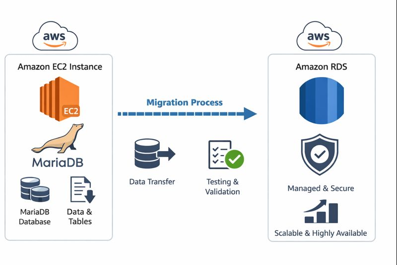
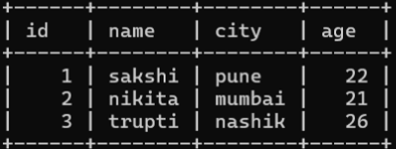

# Database Migration from Local Server to Amazon RDS
### Introduction 
In this project, a MariaDB database is set up on an Amazon EC2 instance acting as a local server. The database is populated with data and then migrated to Amazon RDS to take advantage of a fully managed, scalable, and highly available database service. This document describes the basic steps involved in migrating an EC2-hosted MariaDB database to Amazon RDS while ensuring data integrity.
### Architecture Diagram

### Migration Process Steps 
### Step 1 : Create Amazon RDS (MariaDB)
Step 1: Create Amazon RDS (MariaDB)
Step 1: Create Amazon RDS (MariaDB)
* Open AWS Console and go to Aurora and RDS.
* Create a new database using Standard create.
* Select MariaDB as the engine.
* Set DB identifier and admin username.
* Choose Password authentication and set password.
* Select instance class and VPC.
* Allow port 3306 in the security group.
* Create the database and wait until it becomes Available.
* Note the RDS endpoint and port.

### Step 2: Create EC2 Instance (Local Server)
• Open AWS Console → EC2 → Launch instance  
• Set instance name  
• Choose Amazon Linux AMI  
• Select instance type t3.micro  
• Create or select key pair  
• Use default VPC and enable public IP  
• Allow ports 22 (SSH) and 3306 (MariaDB)  
• Launch the instance  
• Wait for Running state  
• Note public IP address  
### Step 3: Connect to EC2 and Install MariaDB (PowerShell)
* ssh -i .\Downloads\database-project.pem ec2-user@ip
* sudo hostnamectl set-hostname traditional
* exit
* ssh -i .\Downloads\database-project.pem ec2-user@ip
* sudo yum update -y
* sudo yum install mariadb105-server -y
* sudo service start mariadb
* sudo service status mariadb

### step 4: Database Creation and Data Management on MariaDB Server
* mysql -u root
* alter user 'root'@'localhost' identified by 'root';
* mysql -u root -p;
* create database flipkart;
* USE flipkart;
* Create Table
CREATE TABLE user (
  id INT PRIMARY KEY AUTO_INCREMENT,
  name VARCHAR(50),
  city VARCHAR(50),
  age INT
);
* INSERT INTO user (name, city, age) VALUES
('sakshi', 'pune', 22),
('nikita', 'mumbai', 21),
('trupti', 'nashik', 26);
* SELECT * FROM user;
* SHOW DATABASES;
* SHOW TABLES;
* exit;

 ### Step 5 : Migration of data into RDS
 * sudo mysqldump -u root -p flipkart > flipkart_bkp.sql
 (put here mariadb password)
* sudo mysql -h ENDPOINT -u admin -p 
 After pressing Enter, MariaDB will prompt you to enter the local root password.This password is for the local MariaDB server on EC2, not RDS.
 * sudo mysql -h ENDPOINT -u admin -p flipkart < flipkart.bkp.sql
  After pressing Enter, you enter the RDS master password.
  * USE flipkart;
* SHOW TABLES;
* select * from user;

### Summary
A MariaDB database is installed and configured on an Amazon EC2 instance to act as a local server.Sample data is created and stored in the local MariaDB database.An Amazon RDS instance using the MariaDB engine is created as the target database.The local database is backed up using mysqldump and restored into Amazon RDS.The migrated data is verified on RDS to confirm a successful migration.

